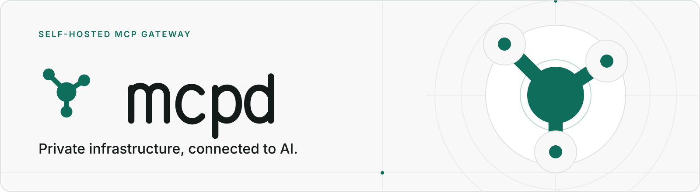

<p align="center">
  <picture>
    <source media="(prefers-color-scheme: dark)" srcset="docs/assets/banner-dark.svg">
    <source media="(prefers-color-scheme: light)" srcset="docs/assets/banner-light.svg">
    
  </picture>
</p>

<h1 align="center">mcpd</h1>

<p align="center">
  <strong>Give ChatGPT access to your private infrastructure — without making it public.</strong>
</p>

<p align="center">
  <a href="https://github.com/dreulavelle/mcpd/actions/workflows/ci.yml"></a>
  <a href="https://github.com/dreulavelle/mcpd/releases/latest"></a>
  <a href="go.mod"></a>
  <a href="https://github.com/dreulavelle/mcpd/pkgs/container/mcpd"></a>
  <a href="https://buymeacoffee.com/dreulavelle"></a>
</p>

<p align="center">
  <a href="#install">Quick start</a> ·
  <a href="#built-in-integrations">Integrations</a> ·
  <a href="#security-and-approvals">Security</a> ·
  <a href="#documentation">Documentation</a> ·
  <a href="#contributing">Contributing</a>
</p>

**mcpd** is a self-hosted Model Context Protocol (MCP) gateway for the apps,
monitoring systems, and infrastructure inside your network. Run it next to
your services, choose what each account can reach, and ask ChatGPT about your
real environment.

The built-in ChatGPT tunnel connects outbound. Your mcpd host needs no public
IP, inbound port forwarding, or public DNS.

## Why mcpd?

- **One gateway, many systems.** Use built-in integrations, import remote MCP
  servers, or build a plugin with the Go SDK.
- **Access you control.** Scope users, groups, API keys, ChatGPT accounts, and
  tunnels to the plugin instances they need.
- **Changes with recorded approval.** Approve in the conversation or define
  standing rules for routine work. Irreversible mutations always need a person.
- **A dashboard for operations.** Manage integrations, tunnels, permissions,
  approval history, logs, and per-tool performance in the browser.
- **One self-contained binary.** The dashboard, database, MCP host, and tunnel
  management ship together. No separate database server or runtime to install.
- **Deployment on your terms.** Run the published container, install a Debian
  package, or use a Linux binary.

[Explore all features](docs/features.md), including SSO, encrypted backups,
private catalogs, and notifications.

## Install

### Docker

You need Docker with the Compose plugin on a host that can reach the systems
you want to connect.

```bash
mkdir -p mcpd/data && cd mcpd
curl -fsSLO https://raw.githubusercontent.com/dreulavelle/mcpd/main/docker-compose.prod.yml
```

The container defaults to UID/GID 1000. On Linux, if your user's UID or GID
differs, add the matching values to `.env` **before the first start**:

```bash
printf 'UID=%s\nGID=%s\n' "$(id -u)" "$(id -g)" >> .env
```

Keep only one entry for each key if `.env` already exists. Then start mcpd:

```bash
docker compose -f docker-compose.prod.yml up -d
```

Open **`http://<server-ip>/`** and create your administrator account.
The published image needs no clone, build, or Go toolchain.

> **Keep management access private.** The default Compose file publishes the
> dashboard on port 80 and the MCP listener on port 8080. Keep both restricted
> to trusted networks. The ChatGPT tunnel does not require either port to be
> exposed to the public internet.

<details>
<summary>Debian packages and standalone binaries</summary>

Download the matching `.deb` from [Releases](https://github.com/dreulavelle/mcpd/releases/latest)
and install it:

```bash
sudo apt install ./mcpd_<version>_<arch>.deb
```

Replace `<version>` and `<arch>` with the downloaded filename. The package
starts mcpd as a system service. Open **`http://<server-ip>/`** to finish setup.

Releases also include standalone `linux-amd64` and `linux-arm64` binaries,
a systemd unit, and checksums.

</details>

<details>
<summary>Build the container from source</summary>

```bash
git clone https://github.com/dreulavelle/mcpd.git
cd mcpd
mkdir -p data
```

On Linux, set UID/GID in `.env` as described above if either differs from 1000.
Then build and start:

```bash
docker compose up -d
```

For native development, see [CLAUDE.md](CLAUDE.md) for build commands and
repository conventions, and [Architecture](docs/architecture.md) for the design.

</details>

> **Back up the data directory, including its `.env` file.** The encryption
> key is in `data/.env` for Docker or `/var/lib/mcpd/.env` on Debian.
> A database copy alone is not enough to recover encrypted credentials.
> See [Backup and restore](docs/backup.md) for the supported backup workflow.

## Get started

1. **Add an integration** and configure the systems it can reach.
2. **Connect your ChatGPT account.**
3. **Create a tunnel** for that account.
4. **Choose which plugin instances the tunnel may access.**
5. **Add the tunnel as a connector in ChatGPT.** Follow the handoff shown on
   mcpd's Tunnels page; creating the tunnel does not attach the connector for you.
6. **Ask about your infrastructure.**

For example:

> “Which access points are down at the high school?”
>
> “What changed on the network before the outage started?”
>
> “Why is this laptop dropping off the Wi-Fi?”

Using another MCP client? The dashboard's **Clients** page helps configure
direct connections with an API key. See [Connecting a client](docs/configuration.md#connecting-a-client).

## Built-in integrations

| Integration | What you can work with | Access |
| --- | --- | --- |
| [Graylog](docs/graylog.md) | Logs, events, alerts, streams, and system health | Read-only |
| [Observium](docs/observium.md) | Devices, interfaces, sensors, alerts, and capacity | Read-only |
| [Cambium cnMaestro](docs/cnmaestro.md) | Wireless networks, clients, alarms, topology, and statistics | Read-only |
| [ExtremeCloud IQ](docs/extremecloudiq.md) | Access points, switches, clients, alerts, and sites | Read-only |
| [Bandwidth](docs/bandwidth.md) | Calls, messages, numbers, port orders, 10DLC, and E911 | Read-only |
| [Flowroute](docs/flowroute.md) | Customer accounts, numbers, inbound routes, E911, CNAM, and port orders | Read-only |
| [Textable](docs/textable.md) | Business SMS tenants, organizations, users, and contacts | Read-only |
| [3CX](docs/3cx.md) | Customer v20 systems, extensions, trunks, routing, queues, and call history | Read-only |
| [BookStack](docs/bookstack.md) | Knowledge-base content, search, users, roles, and permissions | Reads and approval-gated changes |
| [Echo](examples/echo) | A reference plugin for testing the SDK and approval flow | Reads and approval-gated changes |

Create multiple instances of an integration for different sites, customers,
or environments. Access is scoped **per plugin instance**: when an instance
contains several customers, its permitted callers can reach all of them.
Use separate instances when access needs to differ.

Need something else? Browse the MCP marketplace, connect an existing remote
MCP server, or [write your own plugin](docs/plugins.md).

## Security and approvals

**Private connectivity is not local-only AI processing.** Internal services do
not need public endpoints for the ChatGPT tunnel. Permitted tool results still
travel to ChatGPT; choose integrations and access grants with that data flow
in mind.

- **Credentials stay under your management.** Integration secrets are
  encrypted locally. Use narrowly scoped credentials for each connected system.
- **Approval is recorded before a mutation executes.** Standing rules can
  authorize eligible routine changes; irreversible mutations cannot be
  auto-approved by those rules.
- **Approval and verification are different.** A *reviewed change* carries
  exact fields, drift detection, and a confirmed outcome. A *gated call*
  records authorization without claiming all of those guarantees.
- **History is tamper-evident.** A hash-chained audit trail records
  authorizations and operation transitions. The tool-call ledger records who
  called what and how it ended.
- **Optional reporting stays optional.** Crash reporting and update checks
  are off until enabled.

Read [How a change gets made](docs/approvals.md),
[Approval policies](docs/approval-policy.md), and
[Configuration and credentials](docs/configuration.md) before granting write access.

## Documentation

| I want to… | Start here |
| --- | --- |
| Understand the full feature set | [Features](docs/features.md) |
| Configure accounts, credentials, clients, and certificates | [Configuration](docs/configuration.md) |
| Understand approvals and standing rules | [Approval flow](docs/approvals.md) · [Approval policies](docs/approval-policy.md) |
| Back up, restore, or upgrade an instance | [Backup and restore](docs/backup.md) · [Upgrading](docs/upgrading.md) |
| Maintain an approved server catalog | [Private catalogs](docs/catalog.md) |
| Configure outbound notifications | [Notifications](docs/notifications.md) |
| Build an integration | [Plugin guide](docs/plugins.md) · [Go SDK](sdk) · [Echo example](examples/echo) |
| Understand the implementation | [Architecture](docs/architecture.md) |

## Contributing

Bug reports, documentation improvements, and integration proposals are welcome.
[Open an issue](https://github.com/dreulavelle/mcpd/issues) with the behavior you
expected, what happened, and steps to reproduce it. Remove credentials,
customer information, and sensitive infrastructure details before sharing logs.

For code changes, start with [Architecture](docs/architecture.md) and
[repository conventions](CLAUDE.md). Discuss substantial changes in an issue
before opening a pull request.

## Support

If mcpd saves you time, you can [buy me a coffee](https://buymeacoffee.com/dreulavelle).
You can also help by reporting a bug, improving the docs, or sharing the project.
